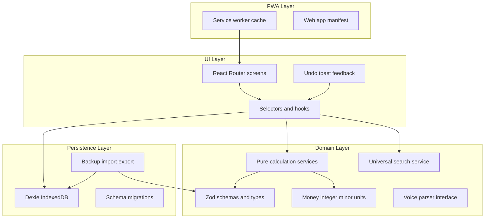

# MyFinance — Phased Implementation Plan (Revised)

Temporary working name: **MyFinance** (replaceable via a single `APP_NAME` / manifest / i18n constant).

**UI language (locked):** English-first. All built-in interface text is English. No language selector in v1. All strings live in a centralized catalog (`src/i18n/en.ts` + `t()`); architecture remains localization-ready for future languages. **Never hardcode visible text inside React components.**

**User-generated content (locked):** Stored and displayed exactly as entered. Never translate, normalize for display, or overwrite titles/categories/account names/notes. Normalization applies only to internal suggestion matching keys (e.g. `normalizedTitle`), not to the visible title.

**Backups:** Plain JSON with Zod validation and an encryption-ready `BackupCodec` envelope. No password encryption in v1.

**Hosting:** Initial target Cloudflare Pages; app is a static Vite build with no Cloudflare-specific runtime dependency. Documented so it can move to Vercel/Netlify/etc. without architecture changes.

---

## Product vision (speed + simplicity)

Build an extremely simple but deeply customizable personal finance application for iPhone (installable PWA). Transactions are the source of truth; the UI must never feel like a spreadsheet or dashboard.

**Speed is a product requirement:** An experienced user should record a normal, previously recognized expense in **approximately five seconds or less**, excluding time spent typing/dictating a long custom title. Optimize continuously for minimum taps, intelligent defaults, recent/frequent ordering, keyboard readiness, one-handed use, and no unnecessary confirmations, loaders, or transitions beyond the compact final review.

The home experience must feel as fast as opening Apple Notes and beginning to type.

---

## Architecture (supports every requirement)



**Core principle:** Transactions are the sole source of truth. Balances, budget usage, stats, and reports are derived via pure services. UI never contains financial formulas. Cached balances are optional performance helpers only; always recalculable from the ledger.

**Chosen defaults (locked):**
- Stack: React 18 + TypeScript + Vite + `vite-plugin-pwa` + Dexie + React Router + Zod + date-fns + Vitest + Testing Library
- Deploy target: **Cloudflare Pages initially** (SPA fallback + HTTPS + correct PWA base); host-agnostic static output
- Money: **integer minor units** per currency `decimalPlaces` (no float totals)
- Financial dates: **`YYYY-MM-DD` local calendar strings** + separate ISO `createdAt`/`updatedAt`
- Transfers: **one logical transfer record** + two linked ledger legs (`linkedTransferId`), created/edited/deleted atomically
- Period reports: **auto-snapshot on period close** + on-demand reconstruction for open/past periods using budget versions
- Days left: **inclusive of today** through period end (calendar days); documented and tested
- Start day 31 in short months: **clamp to last valid day of that month**
- Missing FX: flag transaction; exclude from budget totals until conversion exists
- Voice: keyboard dictation primary; optional Web Speech API if feature-detected; local deterministic parser behind `VoiceParser` interface
- UI strings: English catalog; user content untouched

---

## Information architecture

### Home = expense-entry flow (not a dashboard)

After onboarding, opening the app **immediately** shows the **first step of expense entry**. The user must not tap an extra “Add Expense” button before entering an amount.

**Root `/` is the amount step.** `/add-expense` may exist as an alias/internal route that renders the same flow, but the visible experience begins on `/`.

Root screen contents:
- Hamburger menu (top-left)
- Minimal heading: **“Add expense”**
- Large amount input (auto-focus when appropriate; `inputmode="decimal"`)
- Current/default currency (visible, not dominant)
- Primary Continue action
- Optional dictation affordance
- No charts, calendar grid, crowded dashboard, or competing navigation chrome

### Drawer (hamburger)

Primary items:
1. Movements
2. Balances
3. Monthly Statistics
4. Reports

Settings is visually secondary near the bottom of the drawer.

Settings contains: Accounts, Categories, Budgets, Funds, Treatments, Currencies, Period settings, Backup and restore, App preferences, Install guide.

---

## Quick expense flow

Steps (one main question each):
1. **Amount** — “How much did you spend?” (this is `/`)
2. **Title** — “What was it?” (free-form; recent/intelligent title suggestions; never merchant-forced)
3. **Account** — “Where did the money come from?” (default, recent, frequent, active only)
4. **Smart confirmation** — amount, title, suggested category, account, date; fund/treatment only if enabled/relevant → **Save expense**

Category picker order: suggestion → favorites → recent → frequent → search → full active list (last resort).

Title and category remain independent forever. Suggestions never overwrite the visible title without an explicit user edit.

Progressive disclosure: “More details” for advanced fields.

### Post-save behavior (exact)

After confirm + save:
1. Persist the transaction safely (atomic DB write).
2. Update derived balances, statistics, budgets, and suggestion memory.
3. Show a **brief, non-blocking** success acknowledgment (toast/snackbar).
4. Return immediately to a **clean amount-entry state** on `/`.
5. Reset the amount field; clear the previous draft.
6. Focus the amount input again when appropriate.
7. Leave the app ready to record another expense.

**Do not** redirect to dashboard, transaction details, history, a full-screen success page, or a blocking modal.

If persistence fails: **do not clear the draft**; show an understandable error; keep entered data.

### Undo after saving (exact)

For ~**5 seconds**, show a compact toast, e.g. **“Expense saved”** with **“Undo”**.

Requirements:
- Undo reverses the newly created transaction safely (atomic).
- Recalculates all affected balances and statistics.
- Restores or correctly adjusts suggestion memory.
- Leaves no partial transaction state.
- Does not require opening history.
- User can start typing the next expense while Undo remains available.
- Toast must not cover the amount input or primary action.
- VoiceOver-accessible; respects `prefers-reduced-motion`.

**v1 queue policy:** Only the **most recently saved** expense is undoable. Saving another expense finalizes the previous one and replaces the Undo opportunity.

---

## Title vs category (strengthened)

| Concept | Role | Example |
|---------|------|---------|
| Title | Specific human description | `Almuerzo Sara`, `Uber aeropuerto` |
| Category | Broad classification | Food, Transportation |

- App may suggest category from title.
- App must never replace, shorten, normalize, or overwrite the visible title without explicit user edit.
- Search, reports, filters, and details retain the original title.
- Acceptance test: title `Almuerzo Sara` + category Food must be searchable by `Sara` and by `Food`, while displayed title remains `Almuerzo Sara`.

---

## Universal transaction search (Movements)

One forgiving search field matches across:
- Transaction title, normalized title, notes
- Category name, account name, fund name, treatment display name
- Currency code
- Common textual date expressions / month or period labels where feasible without ambiguous junk results

Behavior: case-insensitive; accent-insensitive where feasible; whitespace-normalized; fast on a normal personal ledger; **never modifies financial data**. When match is not via title, show why it matched (e.g. category/account). Advanced filters remain behind a secondary control (not permanently visible).

---

## Optional fast gestures (Movements)

Recommended if stable and accessible:
- Swipe left → Delete (still confirm or Undo)
- Swipe right → Duplicate
- Long press or tap → details/edit

Hard rules: non-gesture alternatives always exist; no gesture-only critical actions; accidental horizontal scroll must not immediately destroy data; VoiceOver and desktop get labeled/visible actions. **If gestures risk complexity or a11y issues, ship tap-based actions in v1** and document gestures as a later enhancement. Gestures must not delay or destabilize core finance work.

---

## Visual direction

High-level quality references only (do not copy branding/assets/layouts): Apple Wallet, Apple Reminders, Things 3, Linear, Raycast.

Intended qualities: modern, minimal, calm, premium, native-feeling on iPhone, strong typography, generous whitespace, one obvious action per screen, minimal controls, very few borders, restrained neutral palette, clear hierarchy, subtle depth only when useful, compact financial info without density.

Avoid looking like: Excel, bank dashboards, calendar-first trackers, Mint-style dashboards, YNAB-dense allocation screens, admin panels, category icon walls, marketing landing pages inside the app.

Monthly statistics may use compact progress indicators; must not become a decorative chart dashboard.

**Fonts:** iPhone-suitable system stack (`-apple-system`, `BlinkMacSystemFont`, Segoe UI, sans-serif). Touch targets ≥ 44×44 CSS px. Light and dark appearance. Safe-area insets.

---

## Motion and feedback

- Typical UI transitions: **150–250 ms**, centralized in design/motion tokens (not scattered magic numbers).
- Motion never blocks interaction; saves must not wait for animation.
- Avoid flashy transitions, parallax, bounce-heavy motion, decorative loaders.
- Use motion for continuity, confirmation, drawer, step changes, Undo appearance.
- Respect `prefers-reduced-motion`; preserve meaning without animation.

---

## Onboarding (English copy, philosophy)

First screen communicates clearly and concisely (not a privacy policy):
- Works without connecting bank accounts
- Financial data stored on the device in v1
- User controls accounts, categories, budgets, and rules
- Designed for fast manual recording
- No advertisements
- Do **not** promise “no subscription” unless explicitly committed later

Example direction (exact copy may be refined; English):

> Your finances, organized your way.
>
> No bank connections. No ads. Your data stays on this device. Set up your accounts and categories once, then record each expense in seconds.

Then: base currency → period start day → accounts → categories (minimal template or from scratch) → monthly budget (skippable) → optional advanced → finish → **`/` amount step**.

---

## 1. Phased implementation plan

### Phase 1 — Foundation + lightweight UX skeleton
- Scaffold Vite React-TS; path aliases, ESLint, Vitest
- `vite-plugin-pwa`, manifest, iOS meta, safe-area CSS shell
- Design tokens + **motion tokens** (150–250 ms, reduced-motion)
- React Router: `/` = expense amount step; `/add-expense` alias; full IA routes; onboarding gate
- Dexie DB + migrations + Zod domain schemas
- English message catalog (`src/i18n/en.ts`) + `t()`; structure ready for future locales; `APP_NAME` constant; **no hardcoded UI strings in components**
- App shell, hamburger drawer, **low-fidelity mobile screen skeletons** with fictional/static data to validate navigation + quick-expense step sequence
- Do **not** polish financial screens; do **not** fake calculation logic
- Docs stubs (English): README, ARCHITECTURE, DATA_MODEL, FINANCIAL_RULES, IPHONE_INSTALLATION, BACKUP_AND_RESTORE, TESTING, **DECISIONS.md** (template for dated decisions)

### Phase 2 — Calculation engine (gate)
Pure services + unit tests before data-driven screens:
- `money`, `periodService`, `accountBalanceService`, `budgetService`, `transferService`, `currencyService`, `reportService`, `suggestionService`, `transactionService` (create/undo), `searchService` (pure matching helpers)
- Full §33 financial tests **plus** Undo and search tests listed below
- **Gate:** all engine tests pass; no placeholder math. Polished data-driven UI waits for this gate.

### Phase 3 — Onboarding and settings
- Multi-step **English** onboarding (philosophy screen as above → … → finish → `/`)
- Settings CRUD; system treatments; integrity rules; progressive disclosure flags

### Phase 4 — Quick expense entry (real services + speed validation)
- **UX-validation checkpoint at start:** with real domain services, confirm opening screen, steps, keyboard behavior, save/reset, Undo toast placement, and ~5s path for recognized expenses; refine interaction structure before visual polish
- Implement stepper on `/`; defaults; category hierarchy; confirmation
- Post-save reset + 5s Undo (single latest undoable)
- Never silent-save voice/parsed entries

### Phase 5 — Other transaction flows + Movements
- Income; dedicated transfer flow
- Movements: universal search, collapsible filters, detail/edit/duplicate/delete
- Tap-first actions; gestures only if stable/a11y-safe (else defer)
- Soft-delete or delete+confirm/Undo; recalculate on edit

### Phase 6 — Financial views
- Balances (+ account detail); totals by currency only
- Monthly stats (period, totals, days left, category status, drill-down)
- Reports list, period detail, custom date-range report
- Compact progress only; not a chart dashboard

### Phase 7 — Voice and local parser
- Dictation-friendly inputs; optional mic feature-detect
- Deterministic parser (amount/currency/account aliases/today/yesterday); confidence; confirmation
- Parser behind interface for future smarter parsers

### Phase 8 — Backup and resilience
- Plain JSON envelope; Zod validate; preview; merge/replace warnings
- CSV export; reset-all; subtle backup reminder
- `BackupCodec` with `PlainJsonCodec` only in v1

### Phase 9 — Final UX and QA
- Empty/error/loading; a11y; dark mode; keyboard+safe-area; standalone+offline
- **Speed QA:** experienced-user ~5s recognized expense path
- Post-save reset + Undo placement/behavior; reduced-motion
- Host-agnostic static deploy docs (Cloudflare Pages as initial target + notes for Vercel/Netlify)
- Full suite green; English docs complete; no Excel personal data; DECISIONS.md updated for any mid-build choices

**After every phase:** run tests, fix TS, verify routes/migrations, explain completed work and honest limitations.

---

## 2. Proposed project folder structure

```text
MyFinance/
  index.html
  package.json
  vite.config.ts
  vitest.config.ts
  tsconfig.json
  public/
    icons/
    _redirects              # initial Cloudflare SPA fallback (host-specific file; app code host-agnostic)
    apple-touch-icon.png
  README.md
  ARCHITECTURE.md
  DATA_MODEL.md
  FINANCIAL_RULES.md
  IPHONE_INSTALLATION.md
  BACKUP_AND_RESTORE.md
  TESTING.md
  DECISIONS.md
  src/
    app/
      App.tsx
      router.tsx            # `/` = expense amount step; `/add-expense` alias
      providers.tsx
    config/
      app.ts                # APP_NAME, theme, near-limit %, undoTimeoutMs=5000
      currencies.ts
      motion.ts             # 150–250ms tokens
    i18n/
      en.ts                 # all English UI strings (source of truth for v1)
      index.ts              # t(key) — ready for additional locales later
    styles/
      tokens.css
      reset.css
      safe-area.css
    db/
      database.ts
      schema.ts
      migrations.ts
      seedSystemData.ts     # system treatments, common currencies — no personal data
    domain/
      types/
      schemas/
      enums.ts
    services/
      money/
      period/
      accountBalance/
      budget/
      transaction/          # create, edit, delete, undoLast
      transfer/
      currency/
      report/
      suggestion/
      search/               # universal movement search
      backup/
      voiceParser/
    repositories/
    hooks/
    features/
      onboarding/
      expense/              # root quick-expense flow + undo toast
      income/
      transfer/
      transactions/         # movements, search, filters
      balances/
      monthlyStats/
      reports/
      settings/
      installGuide/
    components/ui/
    utils/dates.ts
    utils/text.ts           # case/accent-insensitive normalize for search only
    test/fixtures/
```

---

## 3. IndexedDB database schema (Dexie)

**DB name:** `myfinance` (tied to replaceable app id constant)  
**Initial `schemaVersion`:** `1`

| Table | Key | Indexes |
|-------|-----|---------|
| `settings` | `id` | — (single row) |
| `currencies` | `code` | `active` |
| `accounts` | `id` | `isActive`, `archivedAt`, `sortOrder`, `currencyCode` |
| `categories` | `id` | `kind`, `isActive`, `isFavorite`, `archivedAt`, `parentCategoryId` |
| `funds` | `id` | `isActive`, `isDefault`, `archivedAt` |
| `treatments` | `id` | `behaviorKey`, `isSystem`, `isActive` |
| `transactions` | `id` | `date`, `accountId`, `categoryId`, `fundId`, `treatmentId`, `transactionType`, `linkedTransferId`, `deletedAt`, `[date+transactionType]`, `normalizedTitle` |
| `budgetPlans` | `id` | `effectiveFrom`, `effectiveTo`, `isActive` |
| `budgetAllocations` | `id` | `budgetPlanId`, `categoryId` |
| `periodReports` | `id` | `periodStart`, `periodEnd`, `closedAt` |
| `titleSuggestions` | `normalizedTitle` | `lastUsedAt`, `useCount` |

All mutable entities store `createdAt`, `updatedAt`; archiveable entities store `archivedAt`. Soft-delete on transactions via `deletedAt`. Migrations in Dexie `version(n).stores(...).upgrade(...)`.

Undo uses the real transaction delete/reverse path (not a separate ledger). Suggestion memory adjustments on undo are defined in `suggestionService` and tested.

---

## 4. TypeScript domain models (summary)

- **MoneyAmount:** `{ currencyCode: string; minorUnits: number }`
- **UserSettings:** as specified; `preferredLanguage: 'en'` initially; no language toggle UI; progressive-disclosure flags
- **Currency / Account / Category / Fund / Treatment:** as specified; Treatment `behaviorKey` stable; **display names for system treatments in English**
- **Transaction:** `date: FinancialDate`; amounts as minor units; title required for expense/income and **immutable except explicit user edit**; `normalizedTitle` for matching only
- **BudgetPlan / BudgetAllocation / PeriodReport:** as specified
- **TitleSuggestion:** as specified
- **BackupEnvelope:** `{ format: 'myfinance-backup'; schemaVersion; appName; exportedAt; codec: 'plain'; payload }`
- **SearchMatch:** `{ transactionId; matchedFields: ... }` for “why matched” UI

Zod schemas are the source of truth; TS types via `z.infer`.

---

## 5. Money-storage strategy

- Integer minor units only; pure `money` helpers; reject NaN/Infinity/empty
- `Intl.NumberFormat` for display; accept `,` and `.` in input safely
- Prefer integer math + rate string for audit; compute integer account/base amounts at save
- Drift tests included

---

## 6. Financial-date and timezone strategy

- Financial date: `YYYY-MM-DD` local calendar string
- Timestamps: ISO-8601 UTC
- Never `toISOString().slice(0,10)` for financial dates
- Period clamp rules; future dates excluded from active spent-so-far
- Days left inclusive of today through period end

---

## 7. PWA offline and iPhone installation strategy

- Service worker precaches app shell; IndexedDB holds all essential data
- Manifest standalone + portrait-primary + icons + theme; iOS meta; safe areas
- English install guide: Safari → Share → Add to Home Screen → open icon; never claim App Store
- Offline essential flows including expense entry, undo, search, balances, stats, reports, backup
- **Hosting:** static Vite build; initial deploy Cloudflare Pages; no Cloudflare Workers/KV/D1/runtime APIs; SPA fallback + SW scope + asset paths documented for portability

---

## 8. Automated tests (additions to original §33)

Retain all original calculation/backup/parser tests. Additionally require:

**Undo**
1. Save then undo expense
2. Balance recalculation after undo
3. Monthly-stat recalculation after undo
4. Undo of over-budget category transaction
5. Undo after timeout is a no-op / rejected safely
6. Save second transaction while first Undo toast visible → only second is undoable; first remains saved

**Title / category / search**
7. Title `Almuerzo Sara` + category Food searchable by `Sara` and `Food`; displayed title unchanged
8. Search by title, category, account
9. Accent-insensitive and mixed-case queries
10. Search never mutates data
11. Match reason available when match is not via title

**Integrity of post-save**
12. Failed save preserves draft
13. Successful save clears draft and returns to amount step

---

## 9. Acceptance criteria (additions)

All original acceptance criteria remain. Additionally:

- Built-in UI is English; no language selector; strings centralized
- User-generated content never auto-translated or title-overwritten by category
- After onboarding, `/` is immediately the amount-entry step (not a dashboard)
- Experienced user can record a recognized expense in ~5 seconds or less (excluding long title entry)
- After save: brief non-blocking toast, reset to clean amount entry, amount focused when appropriate
- 5-second Undo reverses the latest save and recalculates; second save replaces Undo target
- Universal search finds by title, category, account (and other fields listed); filters remain secondary
- Gestures are optional enhancements with tap alternatives (or deferred)
- Motion tokens used; reduced-motion respected; saves not blocked by animation
- Onboarding communicates no banks, on-device data, user-controlled structure, fast manual entry, no ads
- Documentation (README, ARCHITECTURE, DATA_MODEL, FINANCIAL_RULES, TESTING, BACKUP_AND_RESTORE, IPHONE_INSTALLATION, DECISIONS) is English
- Hosting is portable static deploy; Cloudflare Pages is initial target only

---

## 10. Documentation requirements

Create/maintain in English:
- README.md
- ARCHITECTURE.md
- DATA_MODEL.md
- FINANCIAL_RULES.md
- IPHONE_INSTALLATION.md
- BACKUP_AND_RESTORE.md
- TESTING.md
- **DECISIONS.md** — during implementation, record any architectural/product decision not explicit in the spec with: Date, Decision, Reason, Alternatives considered, Consequences, Reversible?

Do not invent decisions in Plan mode beyond what is locked above; create the file in Phase 1 with an intro + initial locked decisions seeded from this plan.

---

## 11. Requirement conflicts, risks, and resolved decisions

### Resolved (no blocker)
| Topic | Decision |
|-------|----------|
| UI language | English catalog only; i18n-ready; no toggle; no hardcoded component strings |
| User content | Never translate/overwrite; titles independent of categories |
| App name | Temporary `MyFinance`, single replace point |
| Backup encryption | Plain JSON v1; `BackupCodec` for future encryption |
| Hosting | Cloudflare Pages **initial** target; host-agnostic static app |
| Home route | `/` = first expense step immediately |
| Post-save | Reset to amount + non-blocking toast; no redirect |
| Undo | ~5s; latest-only; replace on next save |
| Search | Universal forgiving search + secondary filters |
| Gestures | Optional; tap-first; defer if risky |
| Float money | Forbidden for totals; integer minor units |
| Excel personal data | Never shipped |
| Phase gate | Phase 2 engine tests before polished data-driven screens |
| UX checkpoint | Lo-fi shell in Phase 1; interaction review at start of Phase 4 |

### Language note
Where earlier drafts or examples used Spanish UI phrases (e.g. “Agregar gasto”, “Deshacer”), the **built-in UI uses English equivalents** (“Add expense”, “Undo”). Spanish may appear only as **user-entered** content examples (e.g. title `Almuerzo Sara`).

### Risks to manage during build
1. Safari IndexedDB eviction — backup reminders; never claim infallible storage
2. iOS PWA keyboard/safe-area — focused steps; visual viewport testing
3. Service worker update races — versioned precache; never cache user data in SW
4. Budget version overlaps — enforce in service + tests
5. Missing FX — exclude from budget totals; actionable error
6. Transfer atomicity — Dexie transactions
7. Undo vs suggestion memory — define reverse updates; test thoroughly
8. Search performance — indexed fields + in-memory join for names; correctness first
9. Gesture a11y — prefer deferral over fragile swipes
10. Speed vs confirmation — keep one compact confirmation; never silent save for voice

### Non-conflicts
Product/native-minimal design wins over marketing-page aesthetics. System fonts and restrained neutrals are intentional.

### No open questions remaining
**Do not begin Phase 1 until explicit approval and a selected build option.** Then execute Phase 1 → 9 in order with test gates.
